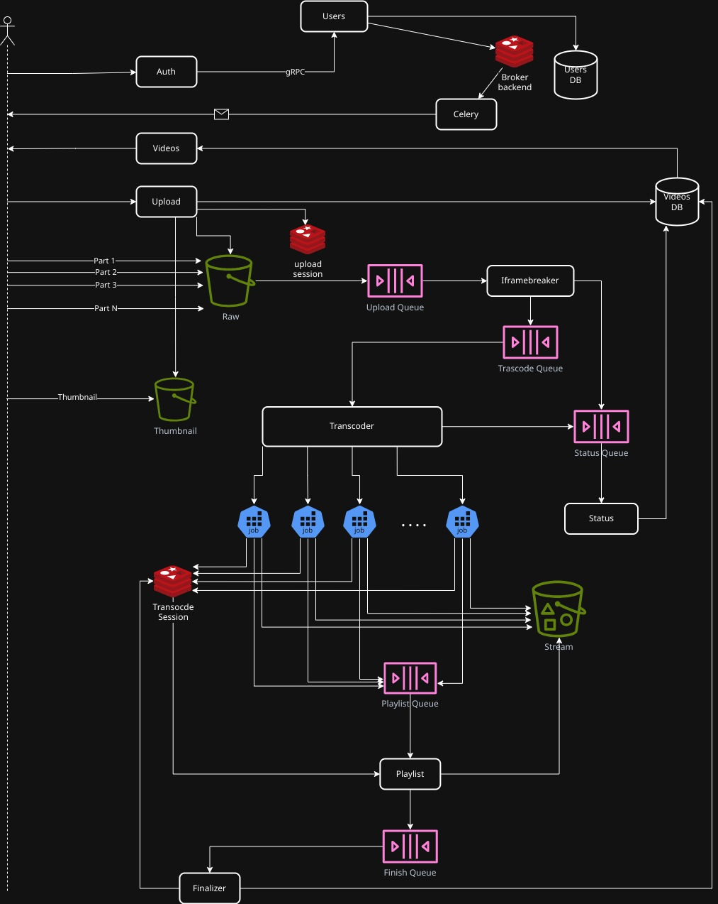

# SimpleVOD

A Kubernative-native distributed video transcoding platform built for scale.

### Architecture

#### The Backend



- **Auth**: Node.js/Express authentication service
- **Users**: Python gRPC service for user management with Celery for background tasks (e.g. Sending account activation emails)
- **Upload**: FastAPI service for video uploads
- **Videos**: Node.js/Express service for video metadata and streaming
- **Transcoder**: Go service that orchestrates video transcoding using Kubernetes Jobs
- **IframeBreaker**: Python service for video analysis and keyframe extraction
- **Playlist**: Python service for HLS playlist generation
- **Finalizer**: Python service for post-processing completion tasks

#### The Frontend

- **Frontend** (Nuxt.js 3):
  - **Adaptive Video Streaming**: HLS.js integration with automatic quality switching
  - **Advanced Upload Experience**: multipart uploads with pause/resume/retry
  - **State Management**: Pinia for predictable state handling

## Quick Start

```bash
minikube start --driver=docker --cpus=4 --memory=8g --disk-size=30g \
    --addons=ingress,metrics-server,dashboard

eval $(minikube -p minikube docker-env)

docker compose build
```

Create a `value-override.yaml` similar to `values-override.example.yaml` with your Email address and password

```bash
helm upgrade --install simplevod helm/app -f helm/app/values-override.yaml
```

### DNS Configurations

```bash
kubectl edit configmaps -n kube-system coredns
```

```yaml
data:
  Corefile: |
    .:53 {
        rewrite name api.minio.simplevod.app simplevod-minio.default.svc.cluster.local
        # ... rest of configuration
```

This configuration enables the upload service to generate presigned URLs using external hostnames

Also for local DNS, update `/etc/hosts` with hostnnames, match with minikube ingress IP

```plaintext
192.168.49.2 simplevod.app
192.168.49.2 auth.simplevod.app
192.168.49.2 upload.simplevod.app
192.168.49.2 videos.simplevod.app
192.168.49.2 console.minio.simplevod.app
192.168.49.2 api.minio.simplevod.app
```

### TLS

```bash
# generate tls certs and ca
./gen-certs.sh

# trust the generated ca (archlinux)
sudo cp helm/app/tls/ca.crt /etc/ca-certificates/trust-source/anchors/simplevod-ca.crt
sudo update-ca-trust
```

```

```
